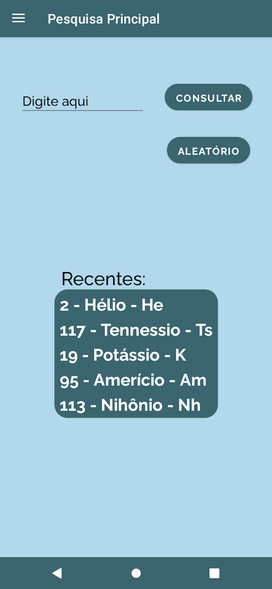
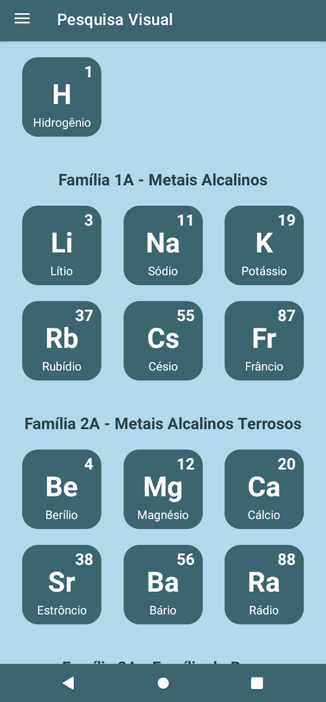
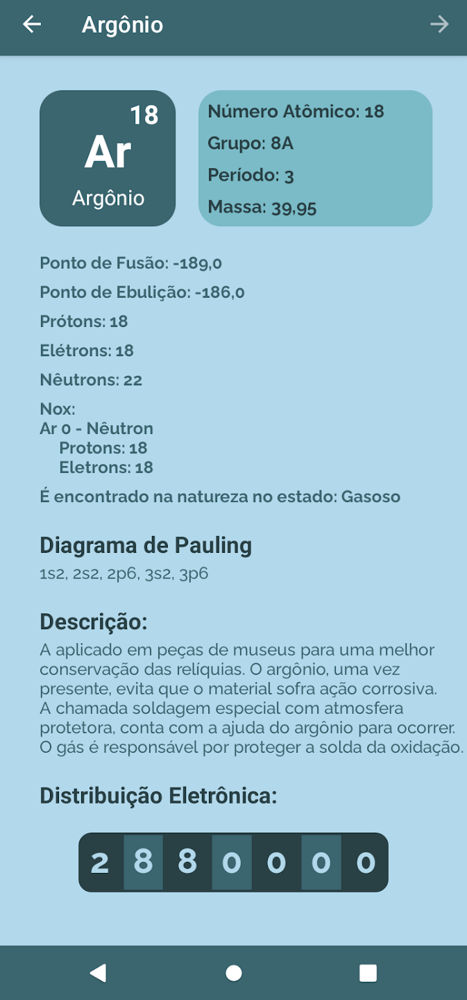
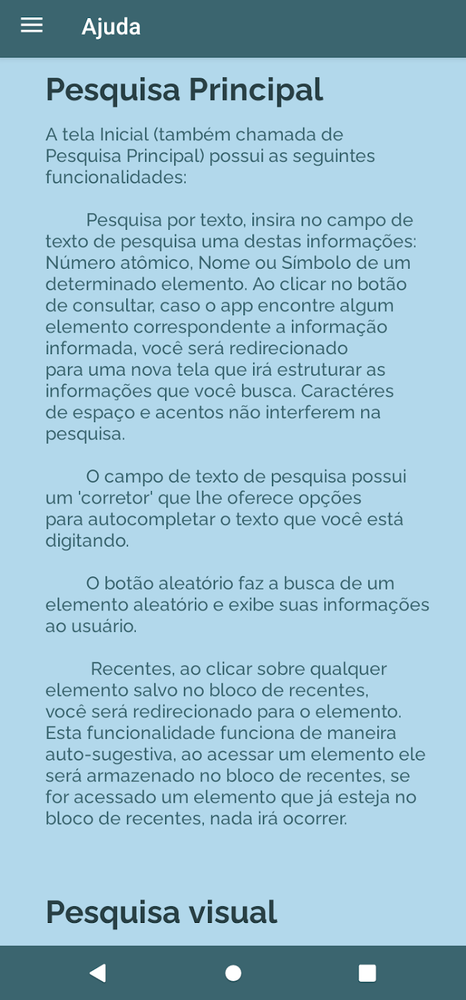

# Química Digital

<!-- Link dos Badges: https://github.com/inttter/md-badges add parametro style=for-the-badge& pra ficar quadrado -->

> Status: Em desenvolvimento 👨‍💻

# 📱 Sobre o projeto

<b>Química Digital</b> é um aplicativo educacional que oferece uma Tabela Periódica Digital que apresenta informações detalhadas sobre os elementos químicos. Desenvolvido com um design moderno e uma interface intuitiva, o app proporciona mecanismos de busca rápidos e eficientes, oferecendo uma excelente experiência ao usuário.

## Licença

 

# 📲 Instalação

Você pode instalar o aplicativo diretamente pela Google Play Store:
  
> [Química Digital na Play Store](https://play.google.com/store/apps/details?id=com.quimicadigital.qumicadigital40)

<b>Pré-requisitos:</b>
 
• Dispositivo com Android 7.0 ou superior

# Telas do Aplicativo

## 🔍 Pesquisa Principal

Na tela inicial, há uma barra de pesquisa onde é possível buscar elementos químicos utilizando:

+ Nome (acentos e maiúsculas não são obrigatórios)
+ Número atômico
+ Símbolo químico

Ao encontrar correspondência, o aplicativo redireciona o usuário para a página do elemento correspondente.

 
 

## Pesquisa Visual

Nessa tela, os elementos são organizados visualmente por famílias e blocos. Cada bloco exibe:

+ Nome do elemento
+ Símbolo
+ Número atômico

Ao tocar em um elemento, o usuário é redirecionado para sua respectiva página de informações.

 
 

## Página de Elementos

Cada elemento químico apresenta as seguintes informações:

+ Nome
+ Símbolo
+ Número atômico
+ Grupo e período
+ Massa atômica
+ Quantidade de prótons, nêutrons e elétrons
+ Diagrama de Pauling
+ Distribuição eletrônica
+ Pontos de fusão e ebulição
+ Energia de ionização
+ Descrição detalhada
+ Imagem ilustrativa (quando disponível)

 

 
 

## ❓ Ajuda

A tela de ajuda funciona como um guia de uso do aplicativo, explicando de forma simples os métodos de busca e funcionalidades disponíveis.

 
 

## ℹ️ Informações

A tela de informações apresenta uma visão geral completa sobre o desenvolvimento do aplicativo. Ela é organizada por tópicos, oferecendo ao usuário mais transparência sobre os objetivos e o processo de criação do Química Digital.

 
 

## Logical Math

O Logical Math é uma funcionalidade complementar integrada ao aplicativo, acessível por meio da barra lateral. Trata-se de um módulo matemático completo que permite realizar diversos tipos de cálculos envolvendo múltiplas variáveis, voltado especialmente para estudantes.

